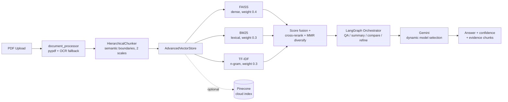

# DocuQuery AI Assistant

Gradio-based RAG application for querying PDF documents with hybrid retrieval (FAISS + BM25 + TF-IDF + reranking), Gemini generation, and optional Pinecone cloud search — with a **reproducible retrieval benchmark** showing the hybrid pipeline achieves **1.00 Recall@5 / 0.99 MRR** on paraphrase queries at **~16ms median retrieval latency** over 1,000 chunks.

This project is domain-agnostic (works across general document types), with a simplified UI and improved readability for answers, previews, comparisons, and exports.

## Live Demo

- Hugging Face Space: [https://huggingface.co/spaces/karthikmulugu08/docuquery-ai-assistant](https://huggingface.co/spaces/karthikmulugu08/docuquery-ai-assistant)

## Retrieval Benchmark

Reproducible micro-benchmark (no API keys needed): **1,000 passages, 100 queries × 4 scenarios**, with McNemar significance tests and 95% bootstrap CIs. Run it yourself:

```bash
python paper/micro_benchmark.py
```

**Recall@5 by scenario** (embedder: `all-MiniLM-L6-v2`):

| Scenario | BM25 | Dense (FAISS) | TF-IDF | **Hybrid** |
|---|---|---|---|---|
| Paraphrase queries | 1.000 | 0.170 | 1.000 | **1.000** |
| OCR-noise queries (2% char corruption) | 0.890 | 0.160 | 0.880 | **0.890** |
| Multilingual passages | 1.000 | 0.210 | 1.000 | **1.000** |
| Identifier-heavy queries | **1.000** | 0.130 | 1.000 | 0.480 |

**Key results:**
- Hybrid retrieval beats dense-only by **+83pp Recall@5** on paraphrase queries (McNemar p < 0.0001) and **+73pp** under OCR noise — the lexical components (BM25/TF-IDF) carry signal that pure embeddings miss on this corpus
- **Mean retrieval latency: 16.3 ± 0.9ms** (95% CI) per query over 1,000 chunks, including query expansion and reranking; index build: 2.1s
- **Honest limitation:** on rare-identifier lookups (e.g., exact document codes), pure BM25 outperforms the hybrid (1.00 vs 0.48) because dense scores dilute exact-match signal — documented rather than hidden, and a known trade-off of fixed-weight fusion

Full methodology and statistical analysis in [`paper/docuquery_ieee.tex`](paper/docuquery_ieee.tex); results auto-generated into [`paper/benchmark_results.tex`](paper/benchmark_results.tex).

## Architecture



## What It Does

- Upload and process one or more PDFs (text-based extraction via `pypdf`)
- Ask natural-language questions over processed documents
- Generate summaries, key points, and detailed follow-ups
- Compare two documents with structured markdown output
- Preview full extracted text, chunk views, and segmentation info
- Export chat to `txt`, `pdf`, or `docx`

## Current Architecture

- `document_processor.py`: PDF extraction + section detection
- `rag_engine.py`: chunking, embeddings, FAISS/BM25/TF-IDF, optional Pinecone
- `llm_interface.py`: Gemini configuration and generation
- `langgraph_orchestrator.py`: LangGraph routing (summary, refine, compare, QA)
- `main.py`: app orchestration logic
- `ui.py`: Gradio UI
- `export_manager.py`: export pipeline and formatting

## Key Features

- Hybrid retrieval: semantic + lexical + reranking
- LangGraph orchestration with safe fallback paths
- Dynamic Gemini model selection (auto-switches to available model)
- Optional Pinecone integrated embeddings (`ragquery` flow supported)
- Better debug evidence display (deduped and query-focused snippets)
- Cleaner UI (removed low-value controls)

## Quick Start

### 1) Install

```bash
pip install -r requirements.txt
```

### 2) Run

```bash
python run.py
```

Open:

- `http://127.0.0.1:7880` (or next available port)

## Environment Variables

You can configure runtime behavior via env vars (recommended for deployment):

- `PORT` (cloud runtime port, if provided by host)
- `GRADIO_SERVER_PORT` (local fallback port)
- `GRADIO_SERVER_NAME` (default `0.0.0.0`)
- `GRADIO_SHARE` (`true/false`)
- `DEFAULT_GEMINI_API_KEY`
- `DEFAULT_PINECONE_API_KEY`
- `DEFAULT_GEMINI_MODEL`
- `PINECONE_INDEX_NAME`
- `PINECONE_CLOUD`
- `PINECONE_REGION`
- `USE_OPENAI_EMBEDDINGS`
- `OPENAI_API_KEY`

## UI Overview

Left panel:

- API configuration (Gemini, Pinecone)
- Upload + process
- Document preview
- System info
- Export conversation

Main panel:

- Chat + Ask
- Per-reply inline info toggle (`i`) for method/confidence/timing/chunks
- Compare documents section
- Language selector

## Notes on Processing Speed

Processing has been optimized by:

- using faster embedding model defaults (`all-MiniLM-L6-v2`)
- reducing chunk scale count (fewer chunk variants)

If your PDFs are very large, processing will still take time due to embedding/indexing.

## Export Behavior

- Exports support `txt`, `pdf`, `docx`
- If PDF/DOCX dependency is unavailable, export falls back to TXT
- Download link appears only when a valid export path exists
- Export formatter strips debug metadata and preserves readable structure

## Hugging Face Spaces Deployment

Recommended free hosting target: **Hugging Face Spaces (Gradio SDK)**.

Live Space URL:

- [https://huggingface.co/spaces/karthikmulugu08/docuquery-ai-assistant](https://huggingface.co/spaces/karthikmulugu08/docuquery-ai-assistant)

### Deploy Steps

1. Push repo to GitHub
2. Create a new Space on Hugging Face and choose **Gradio**
3. Point the Space to this repository (or upload files directly)
4. Add required secrets in Space settings:
   - `DEFAULT_GEMINI_API_KEY`
   - `DEFAULT_PINECONE_API_KEY`
   - `PINECONE_INDEX_NAME` (e.g., `ragquery`)
   - `PINECONE_CLOUD` (e.g., `aws`)
   - `PINECONE_REGION` (e.g., `us-east-1`)
5. Deploy the Space

## Troubleshooting

### App not reachable

- Kill stale Python processes and restart
- Check `PORT` / `GRADIO_SERVER_PORT`
- Try both `127.0.0.1` and `localhost`

### Gemini model not found (404)

- Handled automatically: app lists available models and switches to a supported one

### `list indices must be integers or slices, not float`

- Fixed in Pinecone metadata handling by safe integer casting for `idx`

### Download not working

- Ensure export status shows success
- File output is shown only when a valid export path exists

## Security

- Use env vars for keys in deployment
- Do not commit real credentials

## License

MIT — see `LICENSE`.
